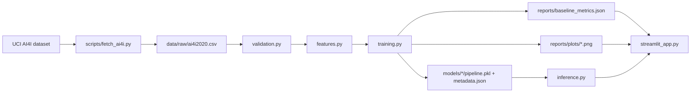

# OpsGuard

OpsGuard is a Python 3.11 predictive-maintenance portfolio project that trains,
evaluates, persists, and demonstrates leakage-controlled scikit-learn baselines
for binary machine-failure risk on the UCI AI4I 2020 dataset.

This is not a production maintenance system. It is a local portfolio baseline
that demonstrates practical ML engineering habits: data acquisition, validation,
feature controls, model comparison, reproducible artifacts, evaluation reporting,
single-record inference, and a Streamlit demo.

## Current Status

Implemented:

- UCI AI4I data acquisition through `ucimlrepo`.
- Schema and quality validation for the local CSV.
- Leakage-controlled feature construction.
- Stratified train/test split with fixed random seed `42`.
- Dummy, logistic-regression, and random-forest baselines.
- Imbalanced-classification metrics, confusion matrices, threshold tables, and
  diagnostic plots.
- Saved scikit-learn model artifacts for local inference experiments.
- Optional Streamlit GUI for single-record risk checks and report review.
- Ruff, mypy, pytest, coverage, and a PowerShell verification script.

Not implemented:

- Production deployment, monitoring, alert routing, calibration governance,
  cloud infrastructure, or a live industrial data feed.

## Demo Screenshots

No checked-in screenshots are currently available. Suggested placeholders:

- `docs/images/opsguard-risk-check.png`: Streamlit risk-check screen with an
  example input preset and result panel.
- `docs/images/opsguard-threshold-tradeoff.png`: Streamlit evaluation screen
  showing the threshold tradeoff chart and selected-model metrics.

## Quick Demo

Install the optional app dependency, generate local artifacts, and launch the
GUI:

```powershell
.\.venv\Scripts\python.exe -m pip install -e ".[app]"
.\.venv\Scripts\python.exe scripts/train_baseline.py --data data/raw/ai4i2020.csv --report-dir reports --model-dir models
.\scripts\run_streamlit_app.ps1
```

The app opens locally with:

- a first-screen project summary;
- example machine-condition presets;
- editable model inputs;
- a risk result panel;
- threshold tradeoff visualization;
- limitations and links to the dataset and evaluation docs.

## Problem

Predictive maintenance models are often evaluated with misleading headline
accuracy because equipment failures are rare. OpsGuard frames the problem as an
imbalanced binary classification task: predict whether a machine-condition row
corresponds to `Machine failure = 1` while keeping target-derived columns out of
the feature set.

The project is designed to show how an AI engineer can build a small but
defensible baseline before moving to heavier MLOps or production-serving work.

## Architecture



Component responsibilities:

- `src/opsguard/data/ai4i.py`: load the local AI4I CSV.
- `src/opsguard/validation.py`: validate schema, target columns, and basic data
  quality.
- `src/opsguard/features.py`: select only pre-label operational features and
  exclude identifiers, targets, and failure-mode labels.
- `src/opsguard/modeling.py`: define the baseline pipelines and stratified
  train/test split.
- `src/opsguard/evaluation.py`: compute metrics, threshold tradeoff rows,
  confusion-matrix interpretation, and error-analysis notes.
- `src/opsguard/training.py`: orchestrate training, reporting, plots, and model
  artifact persistence.
- `src/opsguard/inference.py`: validate one machine-condition record and score
  it with a saved artifact.
- `src/opsguard/streamlit_app.py`: local GUI for demo inference and report
  review.

## Model Approach

Task:

- Binary classification for `Machine failure`.

Input features:

- `Type`
- `Air temperature [K]`
- `Process temperature [K]`
- `Rotational speed [rpm]`
- `Torque [Nm]`
- `Tool wear [min]`

Excluded columns:

- `UDI` / `UID`
- `Product ID`
- `Machine failure`
- `TWF`
- `HDF`
- `PWF`
- `OSF`
- `RNF`

Baselines:

- `DummyClassifier(strategy="most_frequent")`
- `LogisticRegression(class_weight="balanced")`
- `RandomForestClassifier(class_weight="balanced")`

Preprocessing is fit inside scikit-learn pipelines after the train/test split.
The categorical feature is one-hot encoded with unknown-category handling.
Numeric features are scaled for logistic regression and passed through for the
dummy and random-forest baselines.

## Verified Results

The metrics below are from the local report at `reports/baseline_metrics.json`.
They use a stratified 80/20 train/test split with random seed `42`. The held-out
test set contains 2,000 rows: 1,932 non-failure rows and 68 failure rows.

| Model | Average precision | ROC-AUC | Balanced accuracy | Failure precision | Failure recall | Failure F1 |
| --- | ---: | ---: | ---: | ---: | ---: | ---: |
| Dummy most frequent | 0.034 | 0.500 | 0.500 | 0.000 | 0.000 | 0.000 |
| Logistic regression | 0.382 | 0.907 | 0.824 | 0.142 | 0.824 | 0.242 |
| Random forest | 0.737 | 0.962 | 0.880 | 0.589 | 0.779 | 0.671 |

At the fixed reporting threshold of `0.5`, the random-forest baseline produced
this held-out confusion matrix:

| Actual class | Predicted no failure | Predicted failure |
| --- | ---: | ---: |
| No failure | 1,895 | 37 |
| Failure | 15 | 53 |

Interpretation: the random forest caught 53 of 68 failure rows and missed 15
failure rows at the reporting threshold. It also flagged 37 non-failure rows.
These counts are useful for discussing review tradeoffs, not for approving an
operational threshold.

## Dataset and Licensing

OpsGuard uses the AI4I 2020 Predictive Maintenance Dataset from the UCI Machine
Learning Repository.

- Source: <https://archive.ics.uci.edu/dataset/601/ai4i>
- DOI: `10.24432/C5HS5C`
- License: Creative Commons Attribution 4.0 International, CC BY 4.0
- Size: 10,000 rows in the current local validation/reporting workflow
- Nature: synthetic predictive-maintenance data

The raw dataset is not committed to this repository. See
[docs/DATA_CARD.md](docs/DATA_CARD.md) for schema, attribution, validation
checks, and limitations.

## Local Setup

Install Python 3.11 and make sure it is available through the Windows launcher
as `py -3.11`.

```powershell
.\scripts\setup.ps1
.\.venv\Scripts\Activate.ps1
```

Fetch the dataset:

```powershell
.\.venv\Scripts\python.exe scripts/fetch_ai4i.py
```

Train baselines and write local reports/artifacts:

```powershell
.\.venv\Scripts\python.exe scripts/train_baseline.py --data data/raw/ai4i2020.csv --report-dir reports --model-dir models
```

The installed CLI exposes the same workflow:

```powershell
.\.venv\Scripts\opsguard.exe evaluate-baselines --data data/raw/ai4i2020.csv --report-dir reports --model-dir models
```

If the virtual environment is activated in the current PowerShell session, the
shorter `opsguard evaluate-baselines ...` form is also available.

## Streamlit GUI

Install the optional app dependency:

```powershell
.\.venv\Scripts\python.exe -m pip install -e ".[app]"
```

Launch the GUI:

```powershell
.\scripts\run_streamlit_app.ps1
```

The GUI reads the latest metrics JSON from `reports/` and loads a saved model
artifact from `models/`. The threshold slider is exploratory and does not modify
the saved artifact.

## Docker GUI Demo

Build the local GUI demo image:

```powershell
docker build -t opsguard-gui-demo .
```

Run the Streamlit app:

```powershell
docker run --rm -p 8501:8501 opsguard-gui-demo
```

Open <http://localhost:8501>. Without mounted artifacts, the app still starts
and explains that reports and model artifacts are missing. This is intentional:
the Docker image installs the package and demo app, but it does not bake in
local datasets, reports, or model artifacts.

Mount existing local artifacts generated on the host:

```powershell
docker run --rm -p 8501:8501 `
  -v "${PWD}\reports:/app/reports:ro" `
  -v "${PWD}\models:/app/models:ro" `
  opsguard-gui-demo
```

Generate data, reports, and model artifacts inside a temporary container volume:

```powershell
docker run --rm `
  -v opsguard-demo-artifacts:/app/data `
  -v opsguard-demo-reports:/app/reports `
  -v opsguard-demo-models:/app/models `
  opsguard-gui-demo `
  sh -c "python scripts/fetch_ai4i.py && python scripts/train_baseline.py --data data/raw/ai4i2020.csv --report-dir reports --model-dir models"

docker run --rm -p 8501:8501 `
  -v opsguard-demo-reports:/app/reports:ro `
  -v opsguard-demo-models:/app/models:ro `
  opsguard-gui-demo
```

Run the lightweight Docker smoke test, if Docker is installed and running:

```powershell
.\scripts\docker_smoke_test.ps1
```

The smoke test builds the image, starts the container, checks Streamlit's
`/_stcore/health` endpoint, and stops the container.

## Single-Record Inference Example

```python
from opsguard.inference import predict_failure

result = predict_failure(
    {
        "Type": "L",
        "Air temperature [K]": 298.1,
        "Process temperature [K]": 308.6,
        "Rotational speed [rpm]": 1551,
        "Torque [Nm]": 42.8,
        "Tool wear [min]": 0,
    },
    "models/<artifact-directory>",
)
print(result.to_dict())
```

## Testing and Verification

Run the full local verification suite:

```powershell
.\scripts\verify.ps1
```

The verification script runs:

- `ruff check .`
- `ruff format --check .`
- `mypy src/opsguard`
- `pytest --cov=opsguard`
- package import smoke test

Optional Docker GUI smoke test:

- `.\scripts\docker_smoke_test.ps1`

Latest verified local check from this workspace: `52 passed, 1 skipped` in the
pytest suite, with Ruff and mypy passing.

GitHub Actions is configured to run the same core checks on Python 3.11 for
pushes to `main` and pull requests targeting `main`.

## Documentation

- [Data card](docs/DATA_CARD.md)
- [Evaluation plan](docs/evaluation_plan.md)
- [Model card](docs/model_card.md)
- [Demo script](docs/demo_script.md)
- [Project brief](docs/project_brief.md)
- [Roadmap](docs/roadmap.md)

## Limitations

- The dataset is synthetic and may not represent real equipment, sensor drift,
  site-specific maintenance policies, or real failure mechanisms.
- The current split is stratified, not chronological; row order is not treated
  as a validated time axis.
- The fixed `0.5` threshold is a reporting convention, not an optimized or
  operationally approved threshold.
- The Streamlit app scores one record at a time and does not include alert
  routing, operator workflow, calibration review, monitoring, or access control.
- Accuracy is reported only for context because the failure class is rare.
- Failure-mode labels are excluded from inputs to avoid target leakage.

## Roadmap

Near-term:

- Add checked-in screenshots or a short GIF for the Streamlit demo.
- Refresh the local metrics report after each material modeling change.
- Expand error analysis with examples of false positives and false negatives.
- Add calibration checks before discussing threshold selection more deeply.

Later:

- Add an API serving layer.
- Add experiment tracking.
- Evaluate a dataset with a validated time axis.
- Add monitoring and drift checks.
- Explore additional predictive-maintenance datasets such as MetroPT-3.

## License

Project code is released under the MIT License. Dataset rights remain with the
dataset publisher and are governed by CC BY 4.0.
